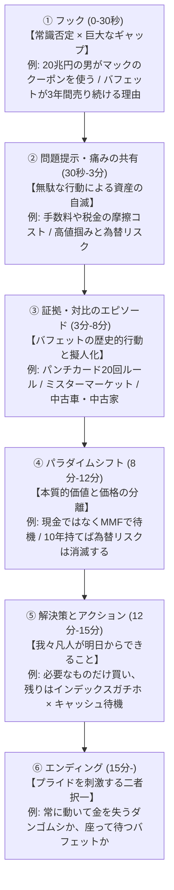

# ④ 動画の逆解析

参考動画5本をYouTubeクリエイターの視点から逆解析し、「自身の動画に転用可能な仕掛けと論理構成パターン」を抽出しました。

---

## 1. 個別動画の逆解析

### ① 『投資の灯台』：プロに頼るな。「座って何もしない」ことで資産を増やす技術（Z2DXSDnL538）

#### ■ 全体の論理構成
**「常識否定（動くプロは負ける） → 真実の提示（待つ技術） → 障壁の明確化（摩擦コスト） → 心理的根拠（原始DNA本能） → 解決策の提示（パンチカード20回ルール） → 感情の克服（ミスターマーケット） → 真の目的（時間と平穏） → 結論（忍耐強い側へ）」**
- **順番の理由**: 最初に「見逃し三振がない」という野球の比喩で視聴者の注意を引き、投資家が勝手に自滅する最大の原因（摩擦コスト）に直面させ、それを解決するルール（パンチカード）と市場と闘うためのメンタルモデル（ミスターマーケット）を順番に提示することで、最後に「動かない勇気」を視聴者に確信させる。
- **情報の出し方**: 結論（何もしないことが最強）を最初に述べつつ、なぜそれが難しいのかの理由を「DNA」「摩擦」「市場の擬人化」と段階的に開示していく。

#### ■ 最初の30秒で何をやっているか
**「野球と投資の決定的な違い（見逃し三振がない）」という意外性のある比喩による常識の否定。**
- **脳内で起きていること**: 「投資の話なのに、なぜ野球？」「見逃し三振がないってどういうこと？」という知的好奇心が刺激され、疑問が解消されるまで動画をスキップできなくなる。

#### ■ 「次も見たい」を生んでいる仕掛け
1. **【1:30】「見えない真の敵＝摩擦コスト」の正体定義**: 税金や手数料を「財布に開いた小さな穴」に例え、無駄な動きが雪だるま（資産）を溶かすことを視覚的に想起させる。
2. **【2:30】「茂みが揺れたら逃げる原始DNA」の話**: 進化心理学を用いて、人間が株価急落でパニック売りするのは生存本能によるものと説明。視聴者は自分の失敗に免罪符を与えられたように感じて引き込まれる。
3. **【3:30】「一生で20回しか買えないパンチカード」の思考実験**: 仮想のルールを視聴者に投げかけ、「自分ならどの1回に使うか」を脳内でシミュレーションさせることで離脱を防ぐ。
4. **【4:30】「情緒不安定な共同経営者＝ミスターマーケット」の物語**: 擬人化されたミスターマーケットの暴れっぷりをユーモラスに語ることで、複雑な市場の動きを理解しやすい物語に変える。

#### ■ 感情の設計図
- **最も高い瞬間**: パンチカードのルールにより、「本当に自分がホームランを打てる球だけを待てばいい」と投資の核心に気づいた時の高揚感。
- **最も低い瞬間**: 無駄な取引のたびに国と証券会社に富をむしり取られ、「自分の雪だるまを自ら削っていた」と痛感する悔恨の瞬間。
- **最大の「え？」ポイント**: ミスターマーケットという「狂人」の気分に、自分たちが一番大切なお金を振り回されていたと気づく瞬間。

#### ■ コメント欄を動かす装置
「あなたは常に動いて金を失うせっかちな側か、座って待って金を手に入れる忍耐強い側か。どちら側にいたいか？」というプライドを刺激する究極の二者択一。

---

### ② 『がまぐち夫婦の節約チャンネル』：ウォーレン・バフェットから学ぶすごい節約投資術7選（c3w1SBT6SYw）

#### ■ 全体の論理構成
**「結論提示（倹約×インデックス） → 7つの手法の列挙（クーポン / 欲しいと必要を分ける / 中古車家 / 食費ケチ / 生活水準別物 / 読書 / インデックス） → まとめ」**
- **順番の理由**: 視聴者が最も関心のある「大富豪なのに〇〇」というギャップ（クーポン、中古品）を前半に配置して視聴維持率を担保し、後半にかけて「読書」「インデックス投資」という実行性の高い実用ノウハウへと繋いでいく。
- **情報の出し方**: 1項目ごとに「エピソード紹介（面白） → 現代の庶民への応用（実用） → 自虐やユーモアでの締め」をパッケージ化して繰り返す。

#### ■ 最初の30秒で何をやっているか
**「20兆円の大富豪の質素な生活」という圧倒的なギャップの提示と、「倹約×インデックス」という最終結論の一発提示。**
- **脳内で起きていること**: 「20兆円持っていて質素ってどういうこと？」「自分でも真似できる投資術って何？」という親近感と驚きが同居し、続きを見る価値を即座に認識する。

#### ■ 「次も見たい」を生んでいる仕掛け
1. **【0:23】「ビル・ゲイツとのマックランチでのクーポン事件」**: 20兆円の男がくしゃくしゃのクーポンを出したという映像的な面白さとセリフ劇（「ビルボ君のケツは青い」）。
2. **【1:11】ヤングバフェットの画像と「蛾の例え」**: 35歳資産30億なら自分なら「夏の夜の蛾のように夜の街を飛び回る」という本音トーク。
3. **【2:00】「新車は買った瞬間に価値が20%下がる」という数理解説**: 「高級車残クレ最強マン」との架空の対決劇で、新車と中古車の価値の差を論理的に論破。
4. **【4:40】為替リスクの「川算用シミュレーション」**: 1ドル160円の超円安でも、複利5%で10年運用すれば為替差損は打ち消せるという具体的な数字の提示。

#### ■ 感情の設計図
- **最も高い瞬間**: 「1ドル160円でも、10年以上の長期なら為替リスクを恐れる必要はない」と数字で論理的に証明された時の安心感。
- **最も低い瞬間**: 読書をしておらず、保険の営業マンに言われるがまま「54万円をドブに捨てた」という発信者本人の手痛い失敗談（痛みの共有）。
- **最大の「え？」ポイント**: バフェットがマックを会社ごと買えるのに、マックの生涯無料ゴールドカード（オマハ限定）を持ってクーポンを使っているという二重の衝撃。

#### ■ コメント欄を動かす装置
「日本の専門家（ダンゴムシ）の話を聞くか、バフェットを信じるか」「見栄のためにフェラーリに乗るか、実利を取ってプリウスに乗るか」という視聴者へのユーモラスな問いかけ。

---

### ③ 『成功の原則』＆『おーちゃん』：3年間売り続ける理由 / なぜ米国株を大量売却したのか（t209eNTWvdw / 9y05dcDuicM）

#### ■ 全体の論理構成
**「衝撃の事実提示（バフェットが3年間株を売り、過去最大の現金を積んでいる） → なぜそうしたのか（バフェット指数、金利と株式利回りの逆転、割安株の消失） → 歴史の教訓（ドットコム・リーマン前夜との類似） → 庶民が取るべき行動（キャッシュ比率調整、インデックス継続） → CTA」**
- **順番の理由**: まず「市場の神様が逃げ出している」という強烈な恐怖フックで視聴者を掴み、その後にマクロ経済の論理的な「証拠」を積み上げ、最後に「では我々はどうすべきか」という解決策で不安を解消し動画を締める。
- **情報の出し方**: 恐怖（暴落）を煽るだけでなく、後半に「実は現金ではなくMMFで金利5%を取って待機している」という詳細な事実を明かすことで、知的好奇心を満たす構成。

#### ■ 最初の30秒で何をやっているか
**「ウォーレン・バフェットが3年かけて58兆円もの現金を積み上げている」という衝撃データと「株式市場崩壊のシグナル」の提示。**
- **脳内で起きていること**: 「え、あのバフェットが米国株を売ってるの？」「自分のS&P500は大丈夫？」という自己防衛本能が刺激され、即座に詳細を知りたくなる。

#### ■ 「次も見たい」を生んでいる仕掛け
1. **【1:00】バフェット指数のチャート表示**: GDPと時価総額の異常な乖離を視覚的に見せ、「明らかに異常である」という事実を突きつける。
2. **【3:00】ドットコムバブル・リーマン前のバフェットの動きの年表化**: 過去の暴落時にも同じようにキャッシュを積んで周囲に笑われ、その後に大復活したという「歴史の再現性」を示す。
3. **【5:00】「現金とMMFの違い」の解説**: 「ただの現金保有はインフレに負けるが、バフェットは5%の短期国債（MMF）でインフレヘッジしながら『待ち伏せ』している」という知的なパラダイムシフト。

#### ■ 感情の設計図
- **最も高い瞬間**: 「暴落は怖いものではなく、準備を整えてキャッシュを持っていれば大富豪になれる大バーゲンセールだ」と見方を変えた瞬間。
- **最も低い瞬間**: 「実体のないIT株バブルに便乗していると、リーマンショックのように10年以上資産が元に戻らない暗黒期を迎える」とリスクを突きつけられた瞬間。
- **最大の「え？」ポイント**: バフェットが「3年間もじっと何も買わずに待っている」という異常なまでの忍耐力の事実。

#### ■ コメント欄を動かす装置
「あなたは今の相場を割高だと思いますか？それともこのまま買い続けますか？あなたの投資戦略を教えてください」という市場の熱量測定的な問いかけ。

---

## 2. 横断的分析と転用可能なテンプレート

### ■ 共通する論理構成パターン（YouTube最強の「バフェット型」構成）

複数動画に共通する、視聴維持率を最大化する構成テンプレートは以下の通りです。

---

### ■ パクれる技法リスト（優先度順）

1. **パンチカード20回ルール（制約のルール化）**
   - **なぜ効くか**: 抽象的な「よく考えて投資しろ」という指示を、「一生で20回しかボタンを押せないゲーム」という強力な制約に変換することで、視聴者の当事者意識と没入感を一瞬で高められるから。
2. **ミスターマーケット（市場のキャラクター化）**
   - **なぜ効くか**: 「株価のボラティリティ」という複雑な金融工学の概念を、「毎日ドアを叩いて奇妙な価格を叫ぶ情緒不安定な隣人」というアニメキャラクターのように可視化し、脳内負荷を極限まで下げられるから。
3. **夏の夜の蛾（自虐的ユーモアによる親近感）**
   - **なぜ効くか**: 「自分がもし30億円持っていたら見栄を張って遊び狂う」という発信者の「庶民の本音」を晒すことで、バフェットの偉大さを引き立てつつ、発信者への心理的防壁（うさん臭さ）を排除できるから。
4. **「客のヨットはどこにある？」（歴史的格言による権威性）**
   - **なぜ効くか**: 金融業界（証券会社やインフルエンサー）が客の利益ではなく「客を動かすこと（取引手数料）」で儲けているという不都合な真実を、格言を用いてエレガントかつ皮肉たっぷりに暴くことで、圧倒的な説得力を生むから。
5. **「葉っぱか服か」レベルの極端な比較**
   - **なぜ効くか**: 「必要なものと欲しいものを分ける」という真面目な概念を、「裸（葉っぱ）か衣服（3万円のスーツ）か、それとも100万円のブランドスーツか」という極端な両極端の対比に落とし込むことで、笑いと共に記憶に焼き付けられるから。
